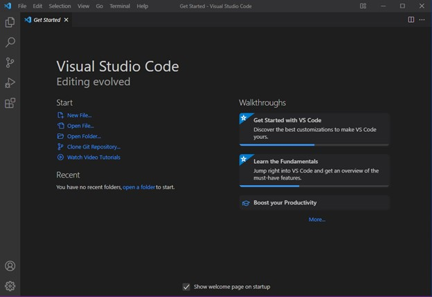

[](https://classroom.github.com/a/XoLGRbHq)
[](https://classroom.github.com/online_ide?assignment_repo_id=15284240&assignment_repo_type=AssignmentRepo)
# SE-Assignment-5
Installation and Navigation of Visual Studio Code (VS Code)
 Instructions:
Answer the following questions based on your understanding of the installation and navigation of Visual Studio Code (VS Code). Provide detailed explanations and examples where appropriate.

 Questions:

1. Installation of VS Code:
   - Describe the steps to download and install Visual Studio Code on Windows 11 operating system. Include any prerequisites that might be needed.

   

Steps to Download and Install Visual Studio Code on Windows 11

1. Prerequisites:
   - Ensure your Windows 11 system is up-to-date with the latest updates installed.
   - You need an active internet connection to download the installer.

2. Download Visual Studio Code:
   - Open your web browser and go to the Visual Studio Code official website: [Visual Studio Code](https://code.visualstudio.com/).
   - Click on the "Download for Windows" button. This will download the installer for Windows.

3. Run the Installer:
   - Once the download is complete, open the downloaded file (usually named something like `VSCodeSetup-x.y.z.exe`, where `x.y.z` is the version number).
   - If prompted by the User Account Control (UAC), click "Yes" to allow the installer to run.

4. Install Visual Studio Code:
   - Step 1: Review the License Agreement
     - The setup wizard will open. Read through the license agreement, check the box to accept the agreement, and click "Next."
   - Step 2: Choose Installation Location
     - Select the destination folder where you want to install Visual Studio Code. The default location is typically fine. Click "Next."
   - Step 3: Select Additional Tasks
     - You will be prompted to select additional tasks such as:
       - Create a desktop icon.
       - Add "Open with Code" action to the context menu.
       - Register Code as an editor for supported file types.
       - Add to PATH (this allows you to open VS Code from the command line).
     - Select the options you prefer and click "Next."
   - Step 4: Ready to Install
     - Review your installation settings and click "Install" to begin the installation process.

5. Complete the Installation:
   - The installer will copy the necessary files and install Visual Studio Code on your system. This process might take a few minutes.
   - Once the installation is complete, you can choose to launch Visual Studio Code immediately by checking the "Launch Visual Studio Code" box, then click "Finish."

6. Launching Visual Studio Code:
   - If you didn't choose to launch it immediately, you can open Visual Studio Code later by finding it in the Start menu or by clicking on the desktop icon if you chose to create one.

 Optional: Installing Additional Tools and Extensions
- Install Git: If you plan to use Git for version control, you should install Git from the [official Git website](https://git-scm.com/). After installing Git, you can integrate it with Visual Studio Code for source control management.
- Extensions: Visual Studio Code supports a wide range of extensions to enhance your development experience. You can browse and install extensions from the Extensions Marketplace within VS Code by clicking on the Extensions view icon on the Sidebar or pressing `Ctrl+Shift+X`.


2. First-time Setup:
   - After installing VS Code, what initial configurations and settings should be adjusted for an optimal coding environment? Mention any important settings or extensions.

After installing Visual Studio Code, configuring it for an optimal coding environment involves adjusting settings and installing extensions tailored to your development needs. Here's a guide to get you started:

 Initial Configurations and Settings

1. Update VS Code:
   - Ensure you are running the latest version of Visual Studio Code by checking for updates (`Help > Check for Updates`).

2. User and Workspace Settings:
   - Open Settings: `File > Preferences > Settings` or `Ctrl + ,`.
   - Customize settings such as:
     - Font Size and Family: Adjust the editor font size and family for better readability. (`editor.fontSize`, `editor.fontFamily`)
     - Tab Size: Set the number of spaces per tab. (`editor.tabSize`)
     - Auto Save: Enable auto-saving of files. (`files.autoSave`)
     - Theme: Choose a UI and syntax theme. (`workbench.colorTheme`)

3. Keyboard Shortcuts:
   - Customize keyboard shortcuts to match your workflow. (`File > Preferences > Keyboard Shortcuts` or `Ctrl + K, Ctrl + S`).

4. Extensions and Plugins:
   - Open Extensions View: `View > Extensions` or `Ctrl + Shift + X`.
   - Recommended Extensions:
     - Language Support:
       - Python: `Python`
       - JavaScript/TypeScript: `ESLint`, `Prettier`
       - C/C++: `C/C++`
       - HTML/CSS: `HTML CSS Support`
       - Markdown: `Markdown All in One`
     - Version Control:
       - Git: `GitLens`, `GitHub Pull Requests and Issues`
     - Code Quality and Formatting:
       - Linting: `ESLint` (for JavaScript/TypeScript), `Pylint` (for Python)
       - Formatting: `Prettier - Code formatter`
     - Productivity:
       - `Live Server`: Launch a development local server with live reload feature for static & dynamic pages.
       - `Bracket Pair Colorizer`: Colorize matching brackets for better readability.
       - `Path Intellisense`: Autocomplete filenames.
       - `IntelliCode`: AI-assisted code suggestions.
     - Docker Support:
       - `Docker`: Essential for containerized applications.

5. Configure Extensions:
   - For each installed extension, configure its settings through the `Settings` (gear icon) in the Extensions view or through the `Settings` JSON file.

 Important Settings

1. Editor Configurations:
   - Word Wrap: Enable word wrap for long lines. (`editor.wordWrap`)
   - Minimap: Enable or disable the code minimap. (`editor.minimap.enabled`)
   - Linting and Formatting: Enable auto-formatting on save. (`editor.formatOnSave`)
   - Error Lens: Highlight errors and warnings inline.

2. Terminal Integration:
   - Integrated Terminal: Customize the integrated terminal settings (`terminal.integrated.shell.windows`) and set up profiles for different shells like PowerShell, Git Bash, or WSL.

3. Workspace Specific Settings:
   - Customize settings for specific projects by saving configurations in a `.vscode/settings.json` file in the workspace folder.

 Sync Settings

- Settings Sync: Enable settings sync to save and synchronize your settings, extensions, and configurations across multiple devices. (`File > Preferences > Settings Sync`)


3. User Interface Overview:
   - Explain the main components of the VS Code user interface. Identify and describe the purpose of the Activity Bar, Side Bar, Editor Group, and Status Bar.

Visual Studio Code (VS Code) has a clean and intuitive user interface (UI) designed to enhance productivity. Here are the main components of the VS Code UI:

 Main Components of the VS Code User Interface

1. Activity Bar:
   - Location: The vertical bar on the far left side of the window.
   - Purpose: The Activity Bar allows you to switch between different views and functionalities within VS Code. It provides quick access to various panels and features.
   - Default Icons:
     - Explorer: Shows the file and folder structure of your workspace.
     - Search: Provides search functionality within files and across the workspace.
     - Source Control: Integrates with Git and other source control providers to manage version control operations.
     - Run and Debug: Accesses the debugging controls and configurations.
     - Extensions: Allows you to browse, install, and manage extensions to enhance functionality.
   - Customization: You can reorder or hide icons to suit your workflow.

2. Side Bar:
   - Location: Immediately to the right of the Activity Bar, occupying the left side of the window.
   - Purpose: The Side Bar displays contextual information and tools related to the currently selected view in the Activity Bar. It changes its content based on the selected activity.
   - Typical Panels:
     - Explorer: Shows the directory structure and files of your project.
     - Source Control: Displays version control status and operations.
     - Search: Displays search results within files.
     - Extensions: Lists installed extensions and allows you to search for new ones.
     - Outline: Shows the structure of the open file, such as classes and methods for code files.

3. Editor Group:
   - Location: The central area where you write and edit your code.
   - Purpose: The Editor Group is where you open and edit files. You can have multiple files open simultaneously in different tabs.
   - Features:
     - Tabs: Each open file appears as a tab at the top of the Editor Group. You can switch between files by clicking on these tabs.
     - Split Editors: Allows you to split the editor into multiple groups either vertically or horizontally to view and edit multiple files side by side.
     - Breadcrumbs: Shows the file path and structure at the top of the editor for easy navigation within the file.

4. Status Bar:
   - Location: The horizontal bar at the bottom of the window.
   - Purpose: The Status Bar provides information about the current state of the editor and workspace. It displays contextual information and quick access to settings and commands.
   - Common Elements:
     - Language Mode: Indicates the programming language of the current file and allows you to change it.
     - Line and Column Numbers: Shows the current line and column number of the cursor.
     - Encoding: Displays and allows you to change the file encoding.
     - EOL (End of Line): Indicates the type of line endings used (CRLF or LF).
     - Indentation: Shows the current indentation setting (spaces or tabs).
     - Git Branch: Displays the current Git branch and status.
     - Notifications: Shows icons for errors, warnings, and other notifications.
     - Live Share: Indicates if you are in a Live Share session.


4. Command Palette:
   - What is the Command Palette in VS Code, and how can it be accessed? Provide examples of common tasks that can be performed using the Command Palette.

   The Command Palette in Visual Studio Code is a powerful feature that allows users to access and execute various commands quickly without navigating through menus or remembering complex keyboard shortcuts. It serves as a central hub for virtually all commands and tasks in VS Code.

 Accessing the Command Palette

The Command Palette can be accessed in two main ways:
1. Keyboard Shortcut: Press `Ctrl + Shift + P` (or `Cmd + Shift + P` on macOS).
2. Menu Navigation: Go to `View > Command Palette...`.

 Using the Command Palette

When you open the Command Palette, a text input box appears at the top of the window. You can start typing to search for commands, and VS Code will provide a list of matching commands.

 Common Tasks Performed Using the Command Palette

1. Opening Files and Folders:
   - Command: `File: Open File...`
   - Example: Quickly open a file without navigating through the file explorer.

2. Running Code:
   - Command: `Run: Start Debugging` or `Run: Run Without Debugging`
   - Example: Start a debugging session or run your application directly.

3. Git Operations:
   - Command: `Git: Commit` or `Git: Push`
   - Example: Commit your changes with a message or push your commits to the remote repository.

4. Installing Extensions:
   - Command: `Extensions: Install Extensions`
   - Example: Search for and install extensions from the marketplace.

5. Changing Settings:
   - Command: `Preferences: Open Settings (UI)` or `Preferences: Open Settings (JSON)`
   - Example: Modify your VS Code settings through the graphical interface or by editing the settings JSON file directly.

6. Formatting Code:
   - Command: `Format Document`
   - Example: Automatically format the entire document according to the defined style rules.

7. Terminal Commands:
   - Command: `Terminal: Create New Integrated Terminal`
   - Example: Open a new terminal within VS Code.

8. Theme and Appearance:
   - Command: `Preferences: Color Theme`
   - Example: Change the color theme of the editor to suit your preference.

9. Snippet Management:
   - Command: `Preferences: Configure User Snippets`
   - Example: Create or edit code snippets for faster coding.

10. Viewing and Navigating Symbols:
    - Command: `Go to Symbol in File...` or `Go to Symbol in Workspace...`
    - Example: Quickly jump to a function, class, or variable definition within the current file or across the entire workspace.

11. Task Management:
    - Command: `Tasks: Run Task` or `Tasks: Configure Task`
    - Example: Execute a predefined task like building or deploying your project.

12. Zen Mode:
    - Command: `View: Toggle Zen Mode`
    - Example: Enter a distraction-free coding environment by hiding extra UI elements.


5. Extensions in VS Code:
   - Discuss the role of extensions in VS Code. How can users find, install, and manage extensions? Provide examples of essential extensions for web development.

 Role of Extensions in VS Code

Extensions in Visual Studio Code (VS Code) significantly enhance the functionality of the editor by adding features, tools, and integrations that cater to various programming languages, frameworks, and workflows. They enable users to customize their development environment to suit their specific needs, improving productivity and efficiency.

 Finding, Installing, and Managing Extensions

 Finding Extensions
1. Extension Marketplace:
   - Open the Extensions view by clicking the Extensions icon in the Activity Bar or by pressing `Ctrl + Shift + X`.
   - Browse through the featured, recommended, and trending extensions.

2. Search Bar:
   - Use the search bar in the Extensions view to find specific extensions by name or keyword.

3. VS Code Marketplace Website:
   - Visit the [Visual Studio Code Marketplace](https://marketplace.visualstudio.com/VSCode) to explore and search for extensions.

 Installing Extensions
1. Via Extensions View:
   - In the Extensions view, find the desired extension and click the "Install" button.
   - The extension will be downloaded and installed automatically.

2. Command Palette:
   - Open the Command Palette (`Ctrl + Shift + P`) and type `Extensions: Install Extensions`.
   - Search for the extension and select it to install.

 Managing Extensions
1. Enabling/Disabling Extensions:
   - In the Extensions view, find the installed extension and click the gear icon (⚙️) next to it.
   - Choose "Disable" to disable the extension or "Enable" to re-enable it.

2. Updating Extensions:
   - Check for updates in the Extensions view. If updates are available, an "Update" button will appear next to the extension.
   - Click the "Update" button to install the latest version.

3. Uninstalling Extensions:
   - In the Extensions view, click the gear icon (⚙️) next to the extension you want to remove.
   - Select "Uninstall" to remove the extension from VS Code.

4. Extension Settings:
   - Configure extension settings by clicking the gear icon (⚙️) and selecting "Extension Settings".
   - Modify the settings in the Settings UI or `settings.json` file.

 Essential Extensions for Web Development

1. HTML and CSS:
   - HTML Snippets: Provides HTML code snippets for faster coding.
   - CSS Peek: Allows peeking to the CSS ID and class strings as definitions from HTML files to respective CSS. It also allows peek and goto definition functionality.

2. JavaScript and TypeScript:
   - ESLint: Integrates ESLint into VS Code, helping you find and fix problems in your JavaScript code.
   - Prettier - Code Formatter: An opinionated code formatter that supports many languages and integrates with VS Code for automatic code formatting.

3. Version Control:
   - GitLens: Supercharges the built-in Git capabilities with features like blame, history, and code lens.
   - GitHub Pull Requests and Issues: Allows you to manage GitHub pull requests and issues directly within VS Code.

4. Frameworks and Libraries:
   - Vue.js: `Vetur` provides tooling support for Vue.js development.
   - React: `ES7+ React/Redux/React-Native snippets` offers a collection of snippets for React and Redux.
   - Angular: `Angular Language Service` provides advanced editing capabilities for Angular templates.

5. Tools and Utilities:
   - Live Server: Launches a development local server with live reload feature for static & dynamic pages.
   - Path Intellisense: Autocompletes filenames for fast and easy file navigation.
   - Debugger for Chrome: Allows debugging JavaScript code running in the Google Chrome browser directly from VS Code.

6. Productivity Enhancements:
   - IntelliCode: Provides AI-assisted code suggestions based on best practices.
   - Auto Rename Tag: Automatically renames paired HTML/XML tags.


6. Integrated Terminal:
   - Describe how to open and use the integrated terminal in VS Code. What are the advantages of using the integrated terminal compared to an external terminal?

 How to Open and Use the Integrated Terminal in VS Code

 Opening the Integrated Terminal

1. Using the Menu:
   - Navigate to `View > Terminal`.

2. Keyboard Shortcut:
   - Press `Ctrl + ` (backtick) or `Ctrl + Shift + ` (backtick) on Windows/Linux.
   - On macOS, use `Cmd + ` (backtick) or `Cmd + Shift + ` (backtick).

3. Command Palette:
   - Open the Command Palette by pressing `Ctrl + Shift + P`.
   - Type `Terminal: Create New Integrated Terminal` and select it.

 Using the Integrated Terminal

Once opened, the integrated terminal appears at the bottom of the VS Code window. Here’s how to make the most of it:

1. Basic Commands:
   - You can use standard command-line instructions just like you would in any external terminal.
   - Examples: `cd` to change directories, `ls` or `dir` to list files, `git` commands for version control, etc.

2. Creating Multiple Terminals:
   - Click the `+` icon in the terminal panel to open a new terminal instance.
   - Use the dropdown next to the `+` icon to select a different shell (e.g., Command Prompt, PowerShell, Git Bash, WSL).

3. Navigating Between Terminals:
   - Use the dropdown in the terminal panel to switch between different terminal instances.
   - Keyboard shortcuts: Use `Ctrl + ` (backtick) to toggle between terminals.

4. Splitting Terminals:
   - Click the split terminal icon (looks like two rectangles) to create a split view of the terminal.
   - Each split terminal can run separate commands simultaneously.

5. Customizing the Terminal:
   - Right-click in the terminal area for options like `Copy`, `Paste`, and `Clear`.
   - Adjust settings like font size, shell, and more through `File > Preferences > Settings` and searching for "terminal".

 Advantages of Using the Integrated Terminal Compared to an External Terminal

1. Convenience and Integration:
   - Single Window Workflow: The integrated terminal allows you to stay within the VS Code environment without switching between applications.
   - Context Awareness: Commands are run in the context of the currently open project/workspace, making path navigation easier and more intuitive.

2. Enhanced Productivity:
   - Quick Access: Open and switch between terminals quickly with keyboard shortcuts and UI controls.
   - Multiple Terminals: Easily manage multiple terminal sessions within the same window, including split views for side-by-side command execution.

3. Built-in Features:
   - Integrated Git: Directly interact with Git repositories using terminal commands while having VS Code’s Git UI for additional functionality.
   - Editor Integration: Easily copy output from the terminal to the editor, or run scripts that affect open files without leaving the editor environment.

4. Customization and Personalization:
   - Consistent Look and Feel: Customize the terminal's appearance and behavior to match the rest of your VS Code setup.
   - Shell Selection: Use different shells (PowerShell, Command Prompt, Git Bash, WSL) without opening separate external windows.

5. Extension Support:
   - Extensions Integration: Some extensions enhance terminal capabilities, such as providing inline error messages, running specific tasks, or integrating with build tools.

6. Ease of Use:
   - File Links: The integrated terminal automatically links file paths and line numbers in error messages, allowing you to click and jump directly to the relevant part of your code.


7. File and Folder Management:
   - Explain how to create, open, and manage files and folders in VS Code. How can users navigate between different files and directories efficiently?

 Creating, Opening, and Managing Files and Folders in VS Code

 Creating Files and Folders

1. Using the Explorer Sidebar:
   - Creating a File:
     - Right-click in the Explorer sidebar within the folder where you want to create a new file.
     - Select "New File" from the context menu.
     - Enter the file name and press `Enter`.
   - Creating a Folder:
     - Right-click in the Explorer sidebar where you want to create a new folder.
     - Select "New Folder" from the context menu.
     - Enter the folder name and press `Enter`.

2. Using the Command Palette:
   - Press `Ctrl + Shift + P` to open the Command Palette.
   - Type `File: New File` and select it to create a new file.
   - Type `Explorer: New Folder` and select it to create a new folder.

3. Keyboard Shortcuts:
   - Use `Ctrl + N` to create a new untitled file in the editor. You can then save it using `Ctrl + S` and specifying the name and location.

 Opening Files and Folders

1. Using the File Menu:
   - Open a File:
     - Go to `File > Open File...` or use the shortcut `Ctrl + O`.
   - Open a Folder:
     - Go to `File > Open Folder...` or use the shortcut `Ctrl + K, Ctrl + O`.

2. Using the Explorer Sidebar:
   - Navigate through the folder structure and click on the file to open it in the editor.
   - Double-click to keep the file open in a tab. A single click opens it in preview mode (italic tab).

3. Drag and Drop:
   - Drag a file or folder from your file explorer (Windows Explorer, Finder on macOS) and drop it into the VS Code window.

 Managing Files and Folders

1. Renaming:
   - Right-click the file or folder in the Explorer sidebar and select "Rename".
   - Enter the new name and press `Enter`.

2. Deleting:
   - Right-click the file or folder and select "Delete".
   - Confirm the deletion in the prompt.

3. Moving:
   - Drag and drop the file or folder to a new location within the Explorer sidebar.

4. Copying and Pasting:
   - Right-click the file or folder, select "Copy", then right-click the target location and select "Paste".

 Navigating Between Files and Directories Efficiently

1. Explorer Sidebar:
   - Use the Explorer sidebar to browse and navigate your project's directory structure.
   - Click on files and folders to open and view them in the editor.

2. Quick Open:
   - Press `Ctrl + P` (Quick Open) to quickly find and open files by typing part of the file name.
   - Use `@` to navigate to symbols within a file, `:` to go to a specific line number, and `` to search within files.

3. File Tabs:
   - Open files appear as tabs at the top of the editor. Click on a tab to switch to that file.
   - Right-click a tab for options like "Close", "Close Others", "Close to the Right", and "Reveal in Explorer".

4. Breadcrumbs:
   - Enable breadcrumbs by going to `View > Show Breadcrumbs`.
   - Use the breadcrumbs at the top of the editor to navigate to different parts of the file or directory structure.

5. Go to Definition:
   - Press `F12` or right-click on a symbol and select "Go to Definition" to jump to its definition within the code.

6. Go Back / Forward:
   - Use `Alt + Left Arrow` to go back to the previous cursor position and `Alt + Right Arrow` to go forward.

7. Command Palette:
   - Open the Command Palette with `Ctrl + Shift + P` and start typing commands like `Open File`, `Open Folder`, `Navigate to Symbol`, etc.

8. Integrated Terminal:
   - Use the integrated terminal to navigate the file system with command-line commands. Open the terminal with `Ctrl + ` (backtick).

9. Side Bar Panels:
   - Utilize other panels like Search, Source Control, and Extensions in the Activity Bar for efficient project management and navigation.


8. Settings and Preferences:
   - Where can users find and customize settings in VS Code? Provide examples of how to change the theme, font size, and keybindings.

Finding and Customizing Settings in VS Code

 Accessing Settings

1. Settings Menu:
   - Go to `File > Preferences > Settings` on Windows/Linux.
   - On macOS, go to `Code > Preferences > Settings`.
   - Alternatively, press `Ctrl + ,` (Windows/Linux) or `Cmd + ,` (macOS).

2. Command Palette:
   - Open the Command Palette with `Ctrl + Shift + P`.
   - Type `Preferences: Open Settings` and select it.

 Customizing Settings

 Changing the Theme

1. Using the Settings Menu:
   - Go to `File > Preferences > Color Theme` (Windows/Linux) or `Code > Preferences > Color Theme` (macOS).
   - A list of available themes will appear. You can preview themes by hovering over them and select one by clicking on it.

2. Using the Command Palette:
   - Open the Command Palette with `Ctrl + Shift + P`.
   - Type `Preferences: Color Theme` and select it.
   - Choose a theme from the list.

 Changing the Font Size

1. Using the Settings Menu (UI):
   - Open the settings (`Ctrl + ,`).
   - In the search bar, type `font size`.
   - Adjust the `Editor: Font Size` setting to your desired value.

2. Editing `settings.json`:
   - Open the Command Palette with `Ctrl + Shift + P`.
   - Type `Preferences: Open Settings (JSON)` and select it.
   - Add or modify the following line:
     ```json
     "editor.fontSize": 14
     ```
   - Save the file.

 Changing Keybindings

1. Using the Keybindings Menu:
   - Go to `File > Preferences > Keyboard Shortcuts` (Windows/Linux) or `Code > Preferences > Keyboard Shortcuts` (macOS).
   - Alternatively, press `Ctrl + K, Ctrl + S`.
   - Use the search bar to find the command you want to rebind.
   - Click the pencil icon next to the command and press the new key combination.

2. Editing `keybindings.json`:
   - Open the Command Palette with `Ctrl + Shift + P`.
   - Type `Preferences: Open Keyboard Shortcuts (JSON)` and select it.
   - Add or modify keybinding entries, for example:
     ```json
     [
       {
         "key": "ctrl+shift+n",
         "command": "workbench.action.files.newUntitledFile"
       },
       {
         "key": "ctrl+b",
         "command": "workbench.action.toggleSidebarVisibility"
       }
     ]
     ```
   - Save the file.


9. Debugging in VS Code:
   - Outline the steps to set up and start debugging a simple program in VS Code. What are some key debugging features available in VS Code?

   Setting Up and Starting Debugging in VS Code

 Step-by-Step Guide to Debug a Simple Program

1. Open or Create a Project:
   - Open VS Code.
   - Open an existing folder or create a new one (`File > Open Folder` or `File > New Folder`).

2. Create a Simple Program:
   - Create a new file for your code. For example, create a file named `app.js` for a simple JavaScript program.
   - Write a simple program. For example, a JavaScript program:
     ```javascript
     // app.js
     function greet(name) {
       console.log(`Hello, ${name}!`);
     }
     greet("World");
     ```

3. Install Necessary Extensions:
   - For JavaScript/Node.js, ensure the "Node.js Extension Pack" or "Debugger for Chrome" is installed.
   - Go to the Extensions view (`Ctrl + Shift + X`), search for the required extensions, and install them.

4. Create a Debug Configuration:
   - Open the Run and Debug view from the Activity Bar on the side (`Ctrl + Shift + D`).
   - Click on `create a launch.json file` or the gear icon to create a debug configuration.
   - Choose the environment. For a Node.js program, select `Node.js`. This will create a `launch.json` file in a `.vscode` folder in your workspace.

5. Configure `launch.json`:
   - VS Code will generate a default configuration. Modify it if necessary. For a simple Node.js program, the default configuration might look like this:
     ```json
     {
       "version": "0.2.0",
       "configurations": [
         {
           "type": "node",
           "request": "launch",
           "name": "Launch Program",
           "skipFiles": ["<node_internals>/"],
           "program": "${workspaceFolder}/app.js"
         }
       ]
     }
     ```
   - Ensure the `program` path points to your main file.

6. Set Breakpoints:
   - Open your code file (`app.js`).
   - Click in the gutter (left margin) next to the line numbers to set breakpoints. Red circles will appear indicating active breakpoints.

7. Start Debugging:
   - In the Run and Debug view, select the configuration you created (e.g., "Launch Program").
   - Click the green play button (or press `F5`) to start debugging.

 Key Debugging Features in VS Code

1. Breakpoints:
   - Set/Clear Breakpoints: Click in the gutter to set or remove breakpoints.
   - Conditional Breakpoints: Right-click on a breakpoint and select "Edit Breakpoint" to add conditions, hit counts, or logpoints.

2. Watch Expressions:
   - Add Watch Expressions: In the Run and Debug view, expand the "Watch" section and click the `+` icon to add expressions you want to monitor.

3. Call Stack:
   - View Call Stack: The Call Stack section shows the stack trace of the running program. You can navigate through the call stack to inspect different frames.

4. Variables:
   - Inspect Variables: The Variables section displays local variables, arguments, and their values. You can expand objects to inspect their properties.

5. Debug Console:
   - Evaluate Expressions: Use the Debug Console to evaluate expressions and execute commands in the context of the paused program.
   - View Output: It also displays program output and debugging messages.

6. Step Controls:
   - Step Over (`F10`): Execute the next line of code but do not step into functions.
   - Step Into (`F11`): Step into functions to debug inside them.
   - Step Out (`Shift + F11`): Step out of the current function and return to the calling code.
   - Continue (`F5`): Resume program execution until the next breakpoint is hit.

7. Exception Handling:
   - Break on Exceptions: Configure breakpoints to pause execution when exceptions are thrown. Modify this in `launch.json` with `"stopOnEntry": true`.

8. Integrated Terminal:
   - Terminal Usage: Use the integrated terminal for running commands or additional scripts during the debugging process without leaving the editor.


10. Using Source Control:
    - How can users integrate Git with VS Code for version control? Describe the process of initializing a repository, making commits, and pushing changes to GitHub.

 Integrating Git with VS Code for Version Control

VS Code provides built-in support for Git, making it easy to manage version control within the editor. Here’s a step-by-step guide to integrating Git, initializing a repository, making commits, and pushing changes to GitHub.

 Step-by-Step Process

 1. Initial Setup

1. Install Git:
   - Ensure Git is installed on your system. You can download it from [git-scm.com](https://git-scm.com/).
   - Verify installation by running `git --version` in your terminal.

2. Open VS Code:
   - Open VS Code and the project folder you want to manage with Git.

 2. Initializing a Repository

1. Open Source Control View:
   - Click on the Source Control icon in the Activity Bar on the side of the window.
   - Alternatively, you can open it using the keyboard shortcut `Ctrl + Shift + G`.

2. Initialize Repository:
   - Click the `Initialize Repository` button in the Source Control view.
   - This creates a `.git` folder in your project directory, setting up the Git repository.

 3. Making Commits

1. Staging Changes:
   - Make changes to your files.
   - In the Source Control view, you will see a list of changed files under "Changes."
   - Hover over a file and click the `+` icon (Stage Changes) to stage the file.
   - You can stage all changes by clicking the `+` icon next to "Changes."

2. Writing a Commit Message:
   - After staging the changes, enter a commit message in the text box above the "Changes" list.

3. Committing Changes:
   - Click the checkmark icon (Commit) above the commit message box.
   - Alternatively, you can use the keyboard shortcut `Ctrl + Enter`.

 4. Pushing Changes to GitHub

1. Connecting to a Remote Repository:
   - If you don’t have a remote repository yet, create one on GitHub:
     - Go to [GitHub](https://github.com/).
     - Click the `New repository` button and follow the prompts to create a new repository.
   - Copy the repository URL from GitHub.

2. Adding the Remote Repository:
   - Open the terminal in VS Code (`Ctrl + ` (backtick)).
   - Add the remote repository using the following command:
     ```sh
     git remote add origin <repository_url>
     ```
   - Replace `<repository_url>` with the URL of your GitHub repository.

3. Pushing Changes:
   - Push your changes to GitHub by clicking the `...` menu in the Source Control view and selecting `Push` (or use the terminal):
     ```sh
     git push -u origin master
     ```
   - If it’s your first push, you may need to set the upstream branch:
     ```sh
     git push -u origin main
     ```
   - Replace `main` with `master` or your default branch name as necessary.

 Summary of Key Features in VS Code's Git Integration

1. Source Control View:
   - Central hub for all Git-related activities, including viewing changes, staging, committing, and synchronizing.

2. Git Commands:
   - Common Git commands like pull, push, fetch, and merge are accessible from the Command Palette (`Ctrl + Shift + P`) by typing "Git."

3. Branch Management:
   - Create, switch, and delete branches directly from the Source Control view or Command Palette.

4. GitLens Extension:
   - Enhances VS Code’s Git capabilities with features like blame, commit search, and repository insights.

5. Diff Viewer:
   - View differences between file versions with a built-in diff viewer by clicking on changed files in the Source Control view.

6. Integrated Terminal:
   - Perform advanced Git operations directly in the integrated terminal within VS Code.


References

1. Geek for Geek : https://www.geeksforgeeks.org/how-to-install-visual-studio-code-on-windows/
3. ChatGpt : https://openai.com/index/chatgpt/
4. PLP Academy : https://plpacademy.powerlearnproject.org/


 Submission Guidelines:
- Your answers should be well-structured, concise, and to the point.
- Provide screenshots or step-by-step instructions where applicable.
- Cite any references or sources you use in your answers.
- Submit your completed assignment by 1st July 

